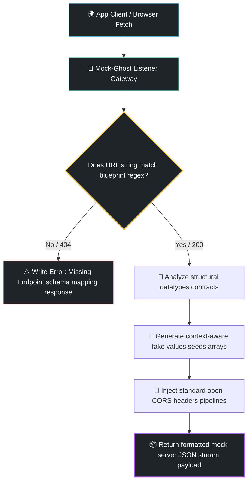

# 👻 Mock-Ghost

[](https://opensource.org)
[](http://makeapullrequest.com)
[](#)

Give your Front-End and Mobile teams absolute engineering autonomy. **Mock-Ghost** is a zero-dependency, blindingly fast CLI engine that reads a single architectural endpoint JSON schema blueprint and instantly spins up a comprehensive, fully functional local mock API server with dynamic realistic data population in milliseconds.

Never get blocked waiting for Back-End staging updates or suffer from unstable sandbox networks environment crashes again.

---

## ⚡ Quick Start

### 1. Define Your Routes Blueprint
Create a file named `routes.json` inside your root directory mapping your endpoints structure schemas:

```json
{
  "/api/v1/users": {
    "id": "uuid",
    "name": "string",
    "email": "email",
    "created_at": "timestamp"
  }
}
```

### 2. Launch the Ghost Server
Execute the lightweight standalone CLI engine passing your blueprint path configuration:

```bash
node mock_ghost.js routes.json 3000
```

---

## 📐 Dynamic Execution Flow Architecture

Mock-Ghost intercepts incoming connections and dynamically computes random payload formats matching structure footprints securely.



---

## 💎 Superpowers Included

* **Zero Dependencies Infrastructure:** Built completely leveraging native core Node.js `http` file streams pipelines. No bloated node_modules trees or heavy runtime weights.
* **Smart URL Params Traversal:** Automatically handles dynamic REST param routes (e.g. `/api/v1/users/:id`) converting path tokens into valid regular expressions evaluation matrices smoothly.
* **Array Wrapper Interpolations:** Supports automated arrays data listings creation. Just append `[]` to any primitive structural token data model type (e.g. `string[]`) to trigger random mock collections array sets.
* **Universal CORS Enabled Profile:** Native global handling configurations pre-wired making it natively reachable across micro-frontends, single-page webapps, mobile emulators, or local network curls.

---

## 🤝 Contributing

We love collaborative optimization enhancements! Want to implement body validator parsers checks, SQLite runtime data states caches, or add custom fake fields parameters?

1. Fork this Repository
2. Add your custom generation schemas logic inside `generateMockValue()` mapping inside `mock_ghost.js`
3. Commit upgrades securely (`git commit -m 'Add custom Credit Card field mocking structure'`)
4. Push upstream (`git push origin feature/AmazingField`)
5. File a clean Pull Request

## 📝 License

Distributed under the MIT License. See `LICENSE` for more architectural details.
